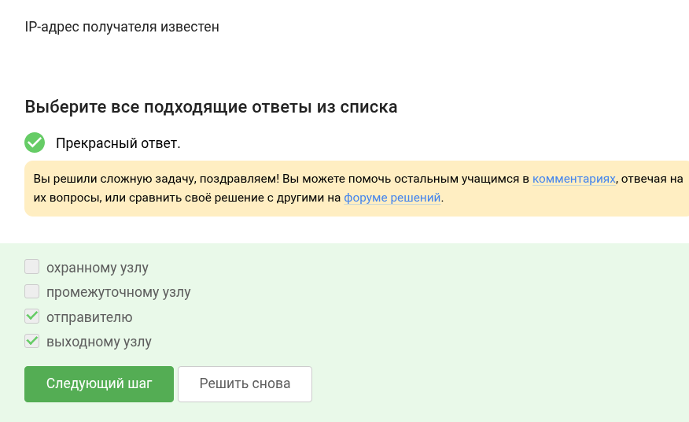
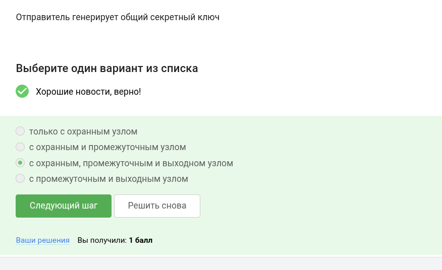

---
## Front matter
lang: ru-RU
title: Курс по основам кибербезопасности
subtitle: Этап 1
author:
  - Ведьмина Александра Сергеевна
institute:
  - Российский университет дружбы народов, Москва, Россия

## i18n babel
babel-lang: russian
babel-otherlangs: english

## Formatting pdf
toc: false
toc-title: Содержание
slide_level: 2
aspectratio: 169
section-titles: true
theme: metropolis
header-includes:
 - \metroset{progressbar=frametitle,sectionpage=progressbar,numbering=fraction}
 - '\makeatletter'
 - '\beamer@ignorenonframefalse'
 - '\makeatother'
---

# Информация

## Докладчик

:::::::::::::: {.columns align=center}
::: {.column width="70%"}

  * Ведьмина Александра Сергеевна
  * студентка
  * Российский университет дружбы народов
  * [1132236003@rudn.ru](mailto:1132236003@rudn.ru)
  * <https://asvedjmina.github.io/ru/>

:::
::: {.column width="30%"}

:::
::::::::::::::

# Цель работы

Выполнить задания первой части курса по кибербезопасности.

# Выполнение лабораторной работы

## Выполнение лабораторной работы

UPD, TCP, IP - протоколы других уровней.

{#fig:001 width=100%}

## Выполнение лабораторной работы

TCP вне всяких сомнений transmission - транспортный уровень.

{#fig:002 width=100%}

## Выполнение лабораторной работы

В ip число между точками не больше 255.

{#fig:003 width=100%}

## Выполнение лабораторной работы

DNS сервер преобразует имена в адреса.

{#fig:004 width=100%}

## Выполнение лабораторной работы

Протоколы действительно распределены по уровням, идущим в таком порядке.

{#fig:005 width=100%}

## Выполнение лабораторной работы

В http данные в открытом виде, в https - в закрытом.

{#fig:006 width=100%}

## Выполнение лабораторной работы

HTTPS включает две фазы - рукопожатие и передачу данных.

{#fig:007 width=100%}

## Выполнение лабораторной работы

Это согласовывается клиентом и сервером.

{#fig:008 width=100%}

## Выполнение лабораторной работы

Шифрования данных нет врукопожатии.

{#fig:009 width=100%}

## Выполнение лабораторной работы

Куки используются для персонализации контента, им не нужны пароли и ip.

{#fig:010 width=100%}

## Выполнение лабораторной работы

Как отмечено ранее, у куки другие цели.

{#fig:011 width=100%}

## Выполнение лабораторной работы

Сервер создает куки.

{#fig:012 width=100%}

## Выполнение лабораторной работы

Сессионные куки очищаются после завершения сессии.

{#fig:013 width=100%}

## Выполнение лабораторной работы

Всего три узла - входной, промежуточный, выходной.

{#fig:014 width=100%}

## Выполнение лабораторной работы

IP скрыт от охранного и промежуточного узла.

{#fig:015 width=100%}

## Выполнение лабораторной работы

Общий ключ создается со всеми узлами.

{#fig:016 width=100%}

## Выполнение лабораторной работы

Это необязательно.

{#fig:017 width=100%}

## Выполнение лабораторной работы

По определению:

{#fig:018 width=100%}

## Выполнение лабораторной работы

Канальный, обеспечивает доступ в сеть.

{#fig:019 width=100%}

## Выполнение лабораторной работы

Устаревший протокол, легко взломать.

{#fig:020 width=100%}

## Выполнение лабораторной работы

Сначала аутентифицируют, потом передают данные.

{#fig:021 width=100%}

## Выполнение лабораторной работы

Из названия понятно, что personal для личного пользования.

{#fig:022 width=100%}

# Выводы

Все задания выполнены.

