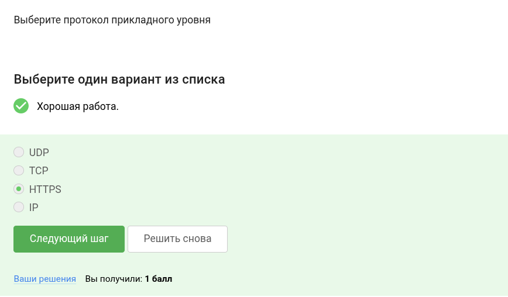
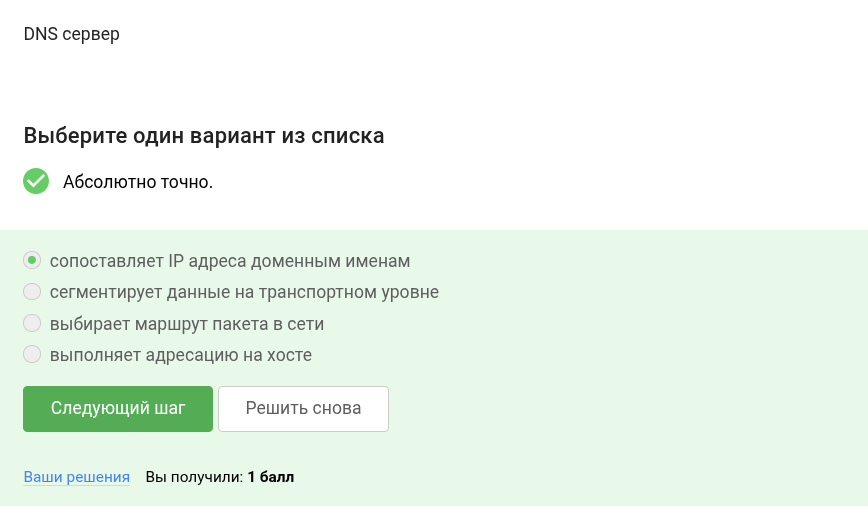
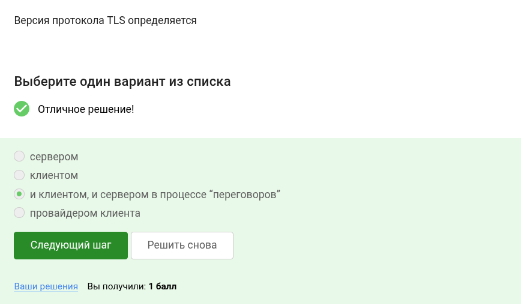
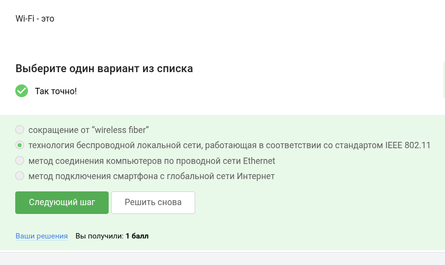
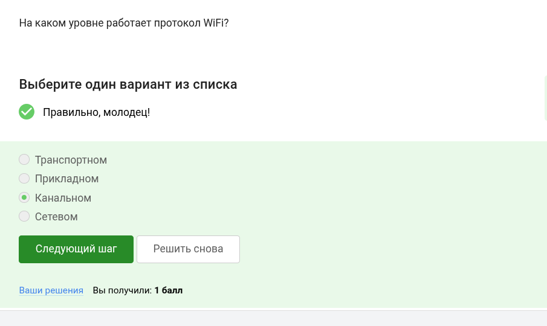
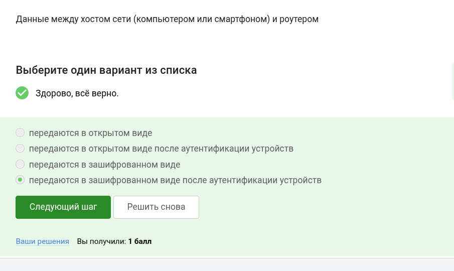
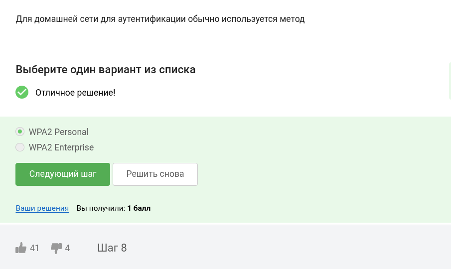

---
## Front matter
title: "Основы кибербезопасности" 
subtitle: "Этап 1"
author: "Ведьмина Александра Сергеевна"

## Generic otions
lang: ru-RU
toc-title: "Содержание"

## Bibliography
bibliography: bib/cite.bib
csl: pandoc/csl/gost-r-7-0-5-2008-numeric.csl

## Pdf output format
toc: true # Table of contents
toc-depth: 2
lof: true # List of figures
lot: true # List of tables
fontsize: 12pt
linestretch: 1.5
papersize: a4
documentclass: scrreprt
## I18n polyglossia
polyglossia-lang:
  name: russian
  options:
	- spelling=modern
	- babelshorthands=true
polyglossia-otherlangs:
  name: english
## I18n babel
babel-lang: russian
babel-otherlangs: english
## Fonts
mainfont: PT Serif
romanfont: PT Serif
sansfont: PT Sans
monofont: PT Mono
mainfontoptions: Ligatures=TeX
romanfontoptions: Ligatures=TeX
sansfontoptions: Ligatures=TeX,Scale=MatchLowercase
monofontoptions: Scale=MatchLowercase,Scale=0.9
## Biblatex
biblatex: true
biblio-style: "gost-numeric"
biblatexoptions:
  - parentracker=true
  - backend=biber
  - hyperref=auto
  - language=auto
  - autolang=other*
  - citestyle=gost-numeric
## Pandoc-crossref LaTeX customization
figureTitle: "Рис."
tableTitle: "Таблица"
listingTitle: "Листинг"
lofTitle: "Список иллюстраций"
lotTitle: "Список таблиц"
lolTitle: "Листинги"
## Misc options
indent: true
header-includes:
  - \usepackage{indentfirst}
  - \usepackage{float} # keep figures where there are in the text
  - \floatplacement{figure}{H} # keep figures where there are in the text
---

# Цель работы

Выполнить задания первой части курса по кибербезопасности.

# Выполнение лабораторной работы

UPD, TCP, IP - протоколы других уровней.

{#fig:001 width=100%}

TCP вне всяких сомнений transmission - транспортный уровень.

{#fig:002 width=100%}

В ip число между точками не больше 255.

{#fig:003 width=100%}

DNS сервер преобразует имена в адреса.

{#fig:004 width=100%}

Протоколы действительно распределены по уровням, идущим в таком порядке.

{#fig:005 width=100%}

В http данные в открытом виде, в https - в закрытом.

{#fig:006 width=100%}

HTTPS включает две фазы - рукопожатие и передачу данных.

{#fig:007 width=100%}

Это согласовывается клиентом и сервером.

{#fig:008 width=100%}

Шифрования данных нет врукопожатии.

{#fig:009 width=100%}

Куки используются для персонализации контента, им не нужны пароли и ip.

{#fig:010 width=100%}

Как отмечено ранее, у куки другие цели.

{#fig:011 width=100%}

Сервер создает куки.

{#fig:012 width=100%}

Сессионные куки очищаются после завершения сессии.

{#fig:013 width=100%}

Всего три узла - входной, промежуточный, выходной.

{#fig:014 width=100%}

IP скрыт от охранного и промежуточного узла.

{#fig:015 width=100%}

Общий ключ создается со всеми узлами.

{#fig:016 width=100%}

Это необязательно.

{#fig:017 width=100%}

По определению:

{#fig:018 width=100%}

Канальный, обеспечивает доступ в сеть.

{#fig:019 width=100%}

Устаревший протокол, легко взломать.

{#fig:020 width=100%}

Сначала аутентифицируют, потом передают данные.

{#fig:021 width=100%}

Из названия понятно, что personal для личного пользования.

{#fig:022 width=100%}

# Выводы

Все задания выполнены.

