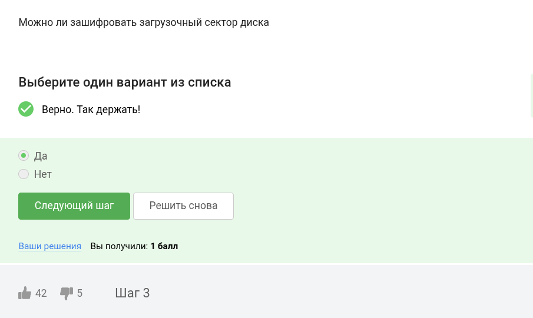
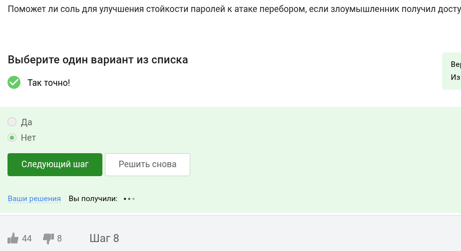

---
## Front matter
lang: ru-RU
title: Курс по основам кибербезопасности
subtitle: Этап 2
author:
  - Ведьмина Александра Сергеевна
institute:
  - Российский университет дружбы народов, Москва, Россия

## i18n babel
babel-lang: russian
babel-otherlangs: english

## Formatting pdf
toc: false
toc-title: Содержание
slide_level: 2
aspectratio: 169
section-titles: true
theme: metropolis
header-includes:
 - \metroset{progressbar=frametitle,sectionpage=progressbar,numbering=fraction}
 - '\makeatletter'
 - '\beamer@ignorenonframefalse'
 - '\makeatother'
---

# Информация

## Докладчик

:::::::::::::: {.columns align=center}
::: {.column width="70%"}

  * Ведьмина Александра Сергеевна
  * студентка
  * Российский университет дружбы народов
  * [1132236003@rudn.ru](mailto:1132236003@rudn.ru)
  * <https://asvedjmina.github.io/ru/>

:::
::: {.column width="30%"}

:::
::::::::::::::

# Цель работы

Выполнить задания второй части курса по кибербезопасности.

# Выполнение лабораторной работы

## Выполнение лабораторной работы

Конечно, можно. Шифрование переводит данные на диске в нераспознаваемый набор символов.

{#fig:001 width=100%}

## Выполнение лабораторной работы

Используется симметричное шифрование.

{#fig:002 width=100%}

## Выполнение лабораторной работы

Bitlocker, vercrypt, есть и много иных.

{#fig:003 width=100%}

## Выполнение лабораторной работы

Пароль должен состоять из разнородных символов и быть сложным для подбора.

{#fig:004 width=100%}

## Выполнение лабораторной работы

В прочих перечисленных вариантах пароль легко украсть.

{#fig:005 width=100%}

## Выполнение лабораторной работы

Капча смотрит подозрительные действия и спрашивает, робот вы или нет.

{#fig:006 width=100%}

## Выполнение лабораторной работы

Для их безопасности. хэш сложно взломать.

{#fig:007 width=100%}

## Выполнение лабораторной работы

Не поможет.

{#fig:008 width=100%}

## Выполнение лабораторной работы

Все перечисленные варианты весьма эфеективны.

{#fig:009 width=100%}

## Выполнение лабораторной работы

Есть отличия от оригинальных ссылок у сбера и яндекса.

{#fig:010 width=100%}

## Выполнение лабораторной работы

Да, знакомый адрес могут взломать.

{#fig:011 width=100%}

## Выполнение лабораторной работы

От английского spoof — обман, подделка.

{#fig:012 width=100%}

## Выполнение лабораторной работы

На то он и троян, что маскируется и сразу не поймёшь, что это вирус.

{#fig:013 width=100%}

## Выполнение лабораторной работы

Сразу же при первом сообщении.

{#fig:014 width=100%}

## Выполнение лабораторной работы

Данные в зашифрованном виде передаются по узлам.

{#fig:015 width=100%}

# Выводы

Все задания выполнены.

