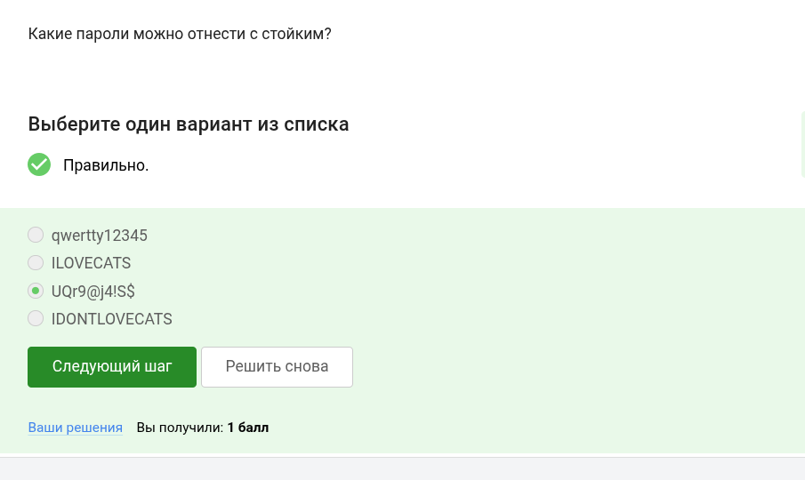
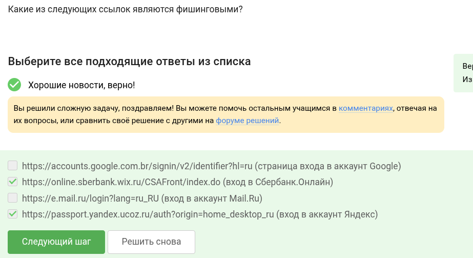
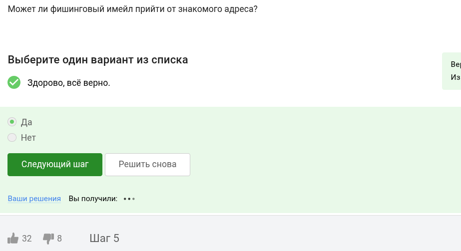
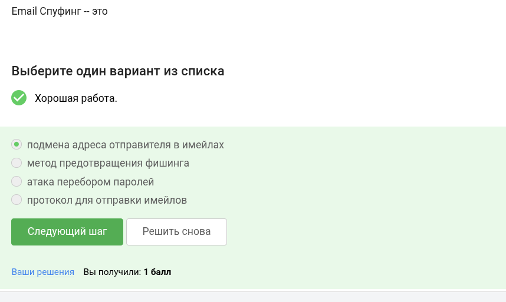
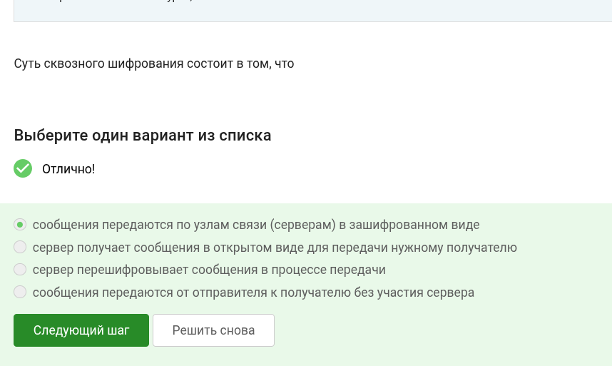

---
## Front matter
title: "Основы кибербезопасности" 
subtitle: "Этап 2"
author: "Ведьмина Александра Сергеевна"

## Generic otions
lang: ru-RU
toc-title: "Содержание"

## Bibliography
bibliography: bib/cite.bib
csl: pandoc/csl/gost-r-7-0-5-2008-numeric.csl

## Pdf output format
toc: true # Table of contents
toc-depth: 2
lof: true # List of figures
lot: true # List of tables
fontsize: 12pt
linestretch: 1.5
papersize: a4
documentclass: scrreprt
## I18n polyglossia
polyglossia-lang:
  name: russian
  options:
	- spelling=modern
	- babelshorthands=true
polyglossia-otherlangs:
  name: english
## I18n babel
babel-lang: russian
babel-otherlangs: english
## Fonts
mainfont: PT Serif
romanfont: PT Serif
sansfont: PT Sans
monofont: PT Mono
mainfontoptions: Ligatures=TeX
romanfontoptions: Ligatures=TeX
sansfontoptions: Ligatures=TeX,Scale=MatchLowercase
monofontoptions: Scale=MatchLowercase,Scale=0.9
## Biblatex
biblatex: true
biblio-style: "gost-numeric"
biblatexoptions:
  - parentracker=true
  - backend=biber
  - hyperref=auto
  - language=auto
  - autolang=other*
  - citestyle=gost-numeric
## Pandoc-crossref LaTeX customization
figureTitle: "Рис."
tableTitle: "Таблица"
listingTitle: "Листинг"
lofTitle: "Список иллюстраций"
lotTitle: "Список таблиц"
lolTitle: "Листинги"
## Misc options
indent: true
header-includes:
  - \usepackage{indentfirst}
  - \usepackage{float} # keep figures where there are in the text
  - \floatplacement{figure}{H} # keep figures where there are in the text
---

# Цель работы

Выполнить задания второй части курса по кибербезопасности.

# Выполнение лабораторной работы

Конечно, можно. Шифрование переводит данные на диске в нераспознаваемый набор символов.

{#fig:001 width=100%}

Используется симметричное шифрование.

{#fig:002 width=100%}

Bitlocker, vercrypt, есть и много иных.

{#fig:003 width=100%}

Пароль должен состоять из разнородных символов и быть сложным для подбора.

{#fig:004 width=100%}

В прочих перечисленных вариантах пароль легко украсть.

{#fig:005 width=100%}

Капча смотрит подозрительные действия и спрашивает, робот вы или нет.

{#fig:006 width=100%}

Для их безопасности. хэш сложно взломать.

{#fig:007 width=100%}

Не поможет.

{#fig:008 width=100%}

Все перечисленные варианты весьма эфеективны.

{#fig:009 width=100%}

Есть отличия от оригинальных ссылок у сбера и яндекса.

{#fig:010 width=100%}

Да, знакомый адрес могут взломать.

{#fig:011 width=100%}

От английского spoof — обман, подделка.

{#fig:012 width=100%}

На то он и троян, что маскируется и сразу не поймёшь, что это вирус.

{#fig:013 width=100%}

Сразу же при первом сообщении.

{#fig:014 width=100%}

Данные в зашифрованном виде передаются по узлам.

{#fig:015 width=100%}

# Выводы

Все задания выполнены.

