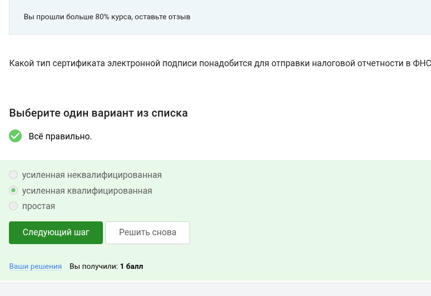

---
## Front matter
lang: ru-RU
title: Курс по основам кибербезопасности
subtitle: Этап 3
author:
  - Ведьмина Александра Сергеевна
institute:
  - Российский университет дружбы народов, Москва, Россия

## i18n babel
babel-lang: russian
babel-otherlangs: english

## Formatting pdf
toc: false
toc-title: Содержание
slide_level: 2
aspectratio: 169
section-titles: true
theme: metropolis
header-includes:
 - \metroset{progressbar=frametitle,sectionpage=progressbar,numbering=fraction}
 - '\makeatletter'
 - '\beamer@ignorenonframefalse'
 - '\makeatother'
---

# Информация

## Докладчик

:::::::::::::: {.columns align=center}
::: {.column width="70%"}

  * Ведьмина Александра Сергеевна
  * студентка
  * Российский университет дружбы народов
  * [1132236003@rudn.ru](mailto:1132236003@rudn.ru)
  * <https://asvedjmina.github.io/ru/>

:::
::: {.column width="30%"}

:::
::::::::::::::

# Цель работы

Выполнить задания третьей части курса по кибербезопасности.

# Выполнение лабораторной работы

## Выполнение лабораторной работы

Два ключа - исходя из определения ассимитричного шифрования.

{#fig:001 width=100%}

## Выполнение лабораторной работы

По свойствам хэш-функции.

{#fig:002 width=100%}

## Выполнение лабораторной работы

Алгоритмы:

{#fig:003 width=100%}

## Выполнение лабораторной работы

Так как для шифровки и дешифровки используется один и тот же ключ.

{#fig:004 width=100%}

## Выполнение лабораторной работы

По определению этого алгоритма.

{#fig:005 width=100%}

## Выполнение лабораторной работы

Потому что используется ассиметричное шифрование.

{#fig:006 width=100%}

## Выполнение лабораторной работы

Подписанное сообщение проверяется открытым ключом.

{#fig:007 width=100%}

## Выполнение лабораторной работы

Она наоборот гарантирует, что можно определить, кто подписал.

{#fig:008 width=100%}

## Выполнение лабораторной работы

Так как в налоговую нужны юридически значимые документы.

{#fig:009 width=100%}

## Выполнение лабораторной работы

В сертифицированном центре.

{#fig:010 width=100%}

## Выполнение лабораторной работы

МИР и Mastercard всем известны.

{#fig:011 width=100%}

## Выполнение лабораторной работы

Отметила верные методы.

{#fig:012 width=100%}

## Выполнение лабораторной работы

Используется многофакторная аутентификация.

{#fig:013 width=100%}

## Выполнение лабораторной работы

Прообраз действительно сложно найти, поэтому она надёжна.

{#fig:014 width=100%}

## Выполнение лабораторной работы

По свойствам консенсуса.

{#fig:015 width=100%}

## Выполнение лабораторной работы

Они хранят цифровые подписи.

{#fig:016 width=100%}

## Выполнение лабораторной работы

Ура, я завершила курс!

{#fig:017 width=100%}

# Выводы

Все задания третьей части выполнены. Курс завершён.

