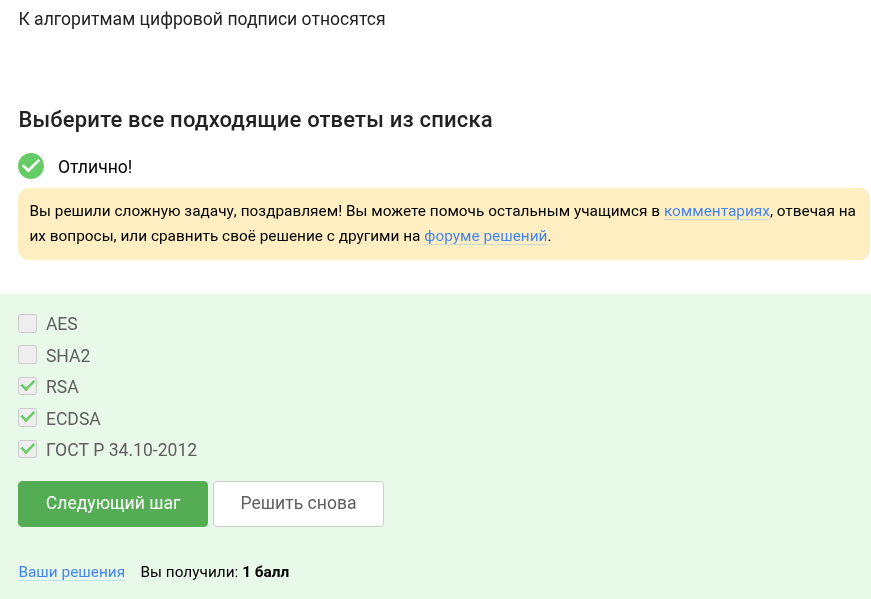
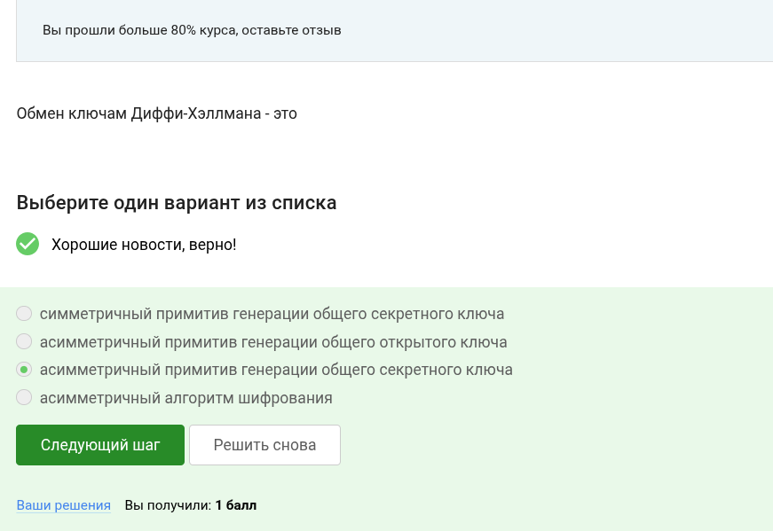
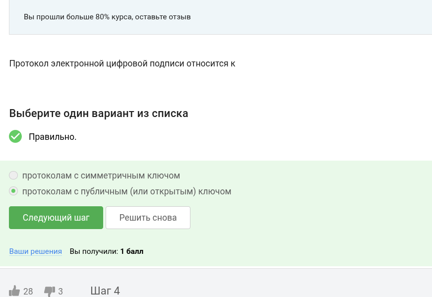
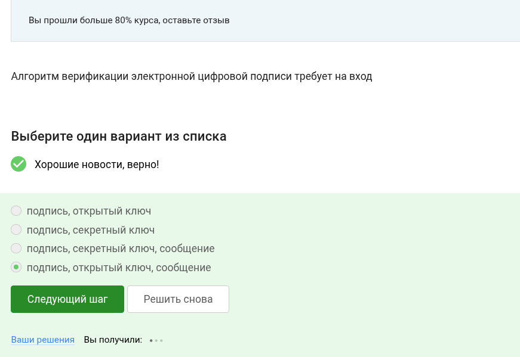
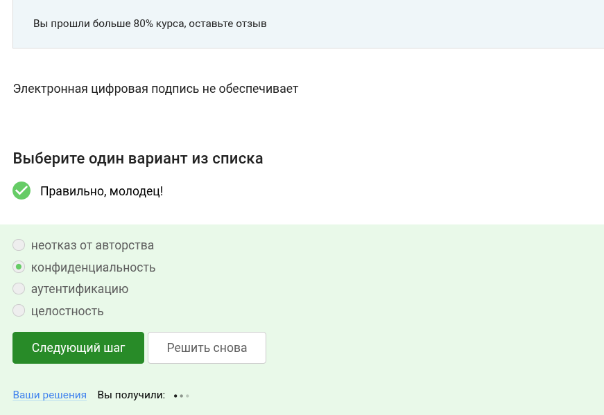
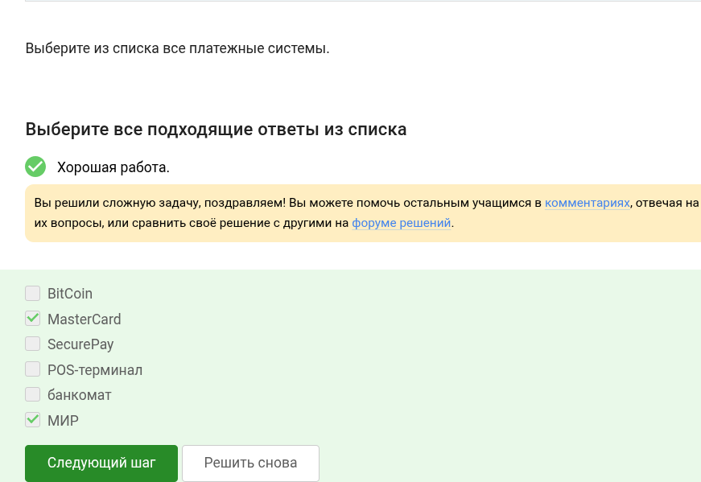

---
## Front matter
title: "Основы кибербезопасности" 
subtitle: "Этап 3"
author: "Ведьмина Александра Сергеевна"

## Generic otions
lang: ru-RU
toc-title: "Содержание"

## Bibliography
bibliography: bib/cite.bib
csl: pandoc/csl/gost-r-7-0-5-2008-numeric.csl

## Pdf output format
toc: true # Table of contents
toc-depth: 2
lof: true # List of figures
lot: true # List of tables
fontsize: 12pt
linestretch: 1.5
papersize: a4
documentclass: scrreprt
## I18n polyglossia
polyglossia-lang:
  name: russian
  options:
	- spelling=modern
	- babelshorthands=true
polyglossia-otherlangs:
  name: english
## I18n babel
babel-lang: russian
babel-otherlangs: english
## Fonts
mainfont: PT Serif
romanfont: PT Serif
sansfont: PT Sans
monofont: PT Mono
mainfontoptions: Ligatures=TeX
romanfontoptions: Ligatures=TeX
sansfontoptions: Ligatures=TeX,Scale=MatchLowercase
monofontoptions: Scale=MatchLowercase,Scale=0.9
## Biblatex
biblatex: true
biblio-style: "gost-numeric"
biblatexoptions:
  - parentracker=true
  - backend=biber
  - hyperref=auto
  - language=auto
  - autolang=other*
  - citestyle=gost-numeric
## Pandoc-crossref LaTeX customization
figureTitle: "Рис."
tableTitle: "Таблица"
listingTitle: "Листинг"
lofTitle: "Список иллюстраций"
lotTitle: "Список таблиц"
lolTitle: "Листинги"
## Misc options
indent: true
header-includes:
  - \usepackage{indentfirst}
  - \usepackage{float} # keep figures where there are in the text
  - \floatplacement{figure}{H} # keep figures where there are in the text
---

# Цель работы

Выполнить задания третьей части курса по кибербезопасности.

# Выполнение лабораторной работы

Два ключа - исходя из определения ассимитричного шифрования.

{#fig:001 width=100%}

По свойствам хэш-функции.

{#fig:002 width=100%}

Алгоритмы:

{#fig:003 width=100%}

Так как для шифровки и дешифровки используется один и тот же ключ.

{#fig:004 width=100%}

По определению этого алгоритма.

{#fig:005 width=100%}

Потому что используется ассиметричное шифрование.

{#fig:006 width=100%}

Подписанное сообщение проверяется открытым ключом.

{#fig:007 width=100%}

Она наоборот гарантирует, что можно определить, кто подписал.

{#fig:008 width=100%}

Так как в налоговую нужны юридически значимые документы.

{#fig:009 width=100%}

В сертифицированном центре.

{#fig:010 width=100%}

МИР и Mastercard всем известны.

{#fig:011 width=100%}

Отметила верные методы.

{#fig:012 width=100%}

Используется многофакторная аутентификация.

{#fig:013 width=100%}

Прообраз действительно сложно найти, поэтому она надёжна.

{#fig:014 width=100%}

По свойствам консенсуса.

{#fig:015 width=100%}

Они хранят цифровые подписи.

{#fig:016 width=100%}

Ура, я завершила курс!

{#fig:017 width=100%}

# Выводы

Все задания третьей части выполнены. Курс завершён.

