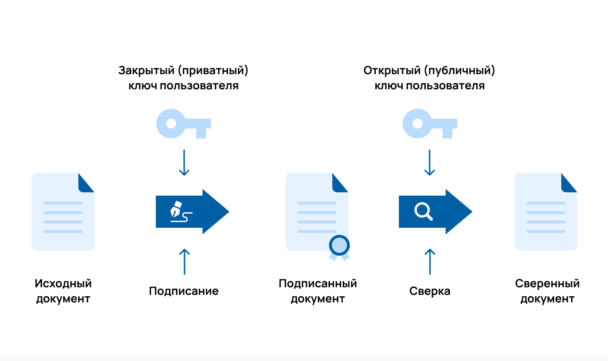
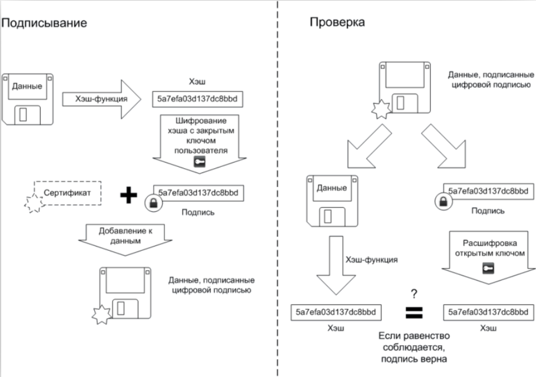

---
## Front matter
lang: ru-RU
title: Доклад 
subtitle: по теме "Цифровая подпись"
author:
  - Ведьмина Александра Сергеевна
institute:
  - Российский Университет Дружбы Народов

## i18n babel
babel-lang: russian
babel-otherlangs: english

## Formatting pdf
toc: false
toc-title: Содержание
slide_level: 2
aspectratio: 169
section-titles: true
theme: metropolis
header-includes:
 - \metroset{progressbar=frametitle,sectionpage=progressbar,numbering=fraction}
 - '\makeatletter'
 - '\beamer@ignorenonframefalse'
 - '\makeatother'
---

# Информация

## Докладчик

:::::::::::::: {.columns align=center}
::: {.column width="70%"}

  * Ведьмина Александра Сергеевна
  * студентка
  * Российский университет дружбы народов
  * [1132236003@rudn.ru](mailto:1132236003@rudn.ru)
  * <https://asvedjmina.github.io/ru/>

:::
::: {.column width="30%"}

:::
::::::::::::::

## Актуальность

В современном мире цифровая экономика и электронная коммерция стремительно развиваются, чем влекут за собой рост онлайн-транзакций и электронного документооборота, требующие надежного и безопасного способа идентификации сторон и подтверждения подлинности документов. ЭЦП обеспечивает юридическую значимость электронных документов, делая возможными электронные контракты, онлайн-банкинг, электронные государственные услуги и многие другие цифровые экономические аспекты.

##  Что такое цифровая подпись

ЭЦП — электронная (цифровая) подпись — это аналог рукописной подписи. Она выполняет ту же функцию — обеспечивает юридическую значимость для документов. Только подписывают с помощью ЭЦП документы не бумажные, а электронные. Кроме того, электронная подпись фиксирует информацию, которая была в документе на момент подписания, тем самым подтверждая её неизменность.

## Как устроена ЭЦП

{#fig:001 width=100%}

## Что такое хэш

1. Уникален для каждого массива информации

2. Хэш-функция необратима и не позволяет восстанавливать исходный массив информации из символьной строки

3. Функция приводит любой объем данных к числу заданной длины

## Как подписывают документы

{#fig:002 width=100%}

## Виды цифровой подписи

1. Простая электронная подпись (ПЭП)

2. Неквалифицированная электронная подпись (НЭП)

3. Квалифицированная электронная подпись (КЭП)

## Риски использования цифровой подписи

1. Утеря ключа

2. Фишинговые атаки

3. Вредоносное ПО

## Заключение

Цифровая подпись представляет собой мощный инструмент в обеспечении информационной безопасности, играющий ключевую роль в современном цифровом мирецифровая подпись представляет собой мощный инструмент в обеспечении информационной безопасности, играющий ключевую роль в современном цифровом мире.
