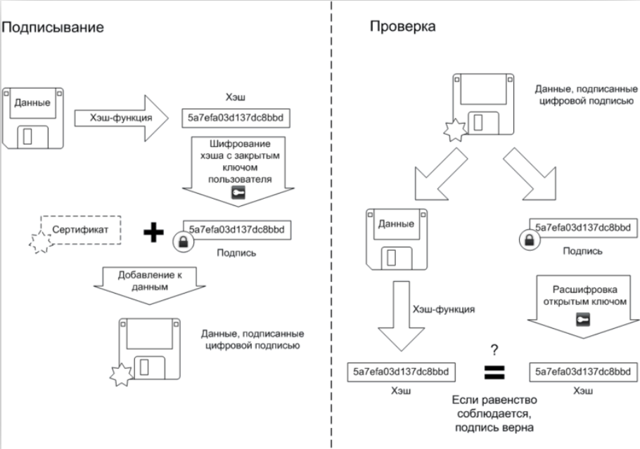

---
## Front matter
title: "Доклад"
subtitle: "Цифровая подпись"
author: "Ведьмина Александра Сергеевна"

## Generic otions
lang: ru-RU
toc-title: "Содержание"

## Bibliography
bibliography: bib/cite.bib
csl: pandoc/csl/gost-r-7-0-5-2008-numeric.csl

## Pdf output format
toc: true # Table of contents
toc-depth: 2
lof: true # List of figures
lot: true # List of tables
fontsize: 12pt
linestretch: 1.5
papersize: a4
documentclass: scrreprt
## I18n polyglossia
polyglossia-lang:
  name: russian
  options:
	- spelling=modern
	- babelshorthands=true
polyglossia-otherlangs:
  name: english
## I18n babel
babel-lang: russian
babel-otherlangs: english
## Fonts
mainfont: PT Serif
romanfont: PT Serif
sansfont: PT Sans
monofont: PT Mono
mainfontoptions: Ligatures=TeX
romanfontoptions: Ligatures=TeX
sansfontoptions: Ligatures=TeX,Scale=MatchLowercase
monofontoptions: Scale=MatchLowercase,Scale=0.9
## Biblatex
biblatex: true
biblio-style: "gost-numeric"
biblatexoptions:
  - parentracker=true
  - backend=biber
  - hyperref=auto
  - language=auto
  - autolang=other*
  - citestyle=gost-numeric
## Pandoc-crossref LaTeX customization
figureTitle: "Рис."
tableTitle: "Таблица"
listingTitle: "Листинг"
lofTitle: "Список иллюстраций"
lotTitle: "Список таблиц"
lolTitle: "Листинги"
## Misc options
indent: true
header-includes:
  - \usepackage{indentfirst}
  - \usepackage{float} # keep figures where there are in the text
  - \floatplacement{figure}{H} # keep figures where there are in the text
---

# Актуальность темы

В современном мире цифровая экономика и электронная коммерция стремительно развиваются, чем влекут за собой рост онлайн-транзакций и электронного документооборота, требующие надежного и безопасного способа идентификации сторон и подтверждения подлинности документов. ЭЦП обеспечивает юридическую значимость электронных документов, делая возможными электронные контракты, онлайн-банкинг, электронные государственные услуги и многие другие цифровые экономические аспекты.

# История появления

Идея электронной цифровой подписи впервые появилась в конце XX века в контексте растущей цифровой эры. Ключевым моментом стало развитие криптографии и необходимость обеспечения безопасности электронных документов и коммуникаций. В 1976 году Уитфилд Диффи и Мартин Хеллман предложили концепцию обмена ключами, что стало отправной точкой для развития методов электронной подписи. Одним из первых прорывов в технологии цифровой подписи стала разработка алгоритма RSA Роном Ривестом, Ади Шамиром и Леонардом Адлеманом в 1977 году. Этот алгоритм заложил основу для многих последующих схем цифровой подписи. Вскоре после RSA были разработаны другие ЭЦП, такие, как алгоритмы цифровой подписи Рабина, Меркле и другие.

В 1984 году Шафи Гольдвассер, Сильвио Микали и Рональд Ривест первыми строго определили требования безопасности к алгоритмам цифровой подписи. Учёные описали возможные атаки на алгоритмы электронной подписи и разработали усовершенствованную криптосистему — GMR. В наши дни используются более современные и надёжные системы, но GMR стала действительно важным шагом в развитии технологии цифровой подписи, которая сегодня широко используются для защиты электронных документов, транзакций и коммуникаций.

# Устройство ЭЦП

В электронной подписи используется асимметричное шифрование, поэтому она состоит из двух основных частей: открытого и закрытого ключа. Закрытый ключ доступен только владельцу, он шифрует документ. Его хранят в памяти компьютера или физических носителях: USB-токенах и смарт-картах. Согласно закону «Об электронной подписи» 63-ФЗ, ответственность за хранение закрытого ключа несёт владелец.

Открытый ключ - сертификат - доступен для всех, с помощью него документ дешифруют и узнают сведения о владельце, об удостоверяющем центре, срок действия цифровой электронной подписи и т.д.. Таким образом подтверждается то, кем был подписан документ, и заверяется его неизменность с момента подписания.

{#fig:001 width=100%}

Разумеется, чтобы использовать ЭП, нужно устанавливать специальные программы, работающие по определённому стандарту шифрования (в России — ГОСТ 34.10-2018). В России одной из наиболее популярных является «КриптоПро CSP».

Рассмотрим подробнее принцип работы ЭЦП. Подписание документа состоит из нескольких этапов: сначала хеш документа шифруется с помощью закрытого ключа, затем полученная подпись добавляется к документу, а после прикрепляется сертификат проверки.

Хэширование представляет собой преобразование любого объема информации в уникальный набор символов, который присущ только этому массиву входящей информации. Этот набор символов и называется хэшем. У такой функции есть несколько полезных свойств:

1. Хэш всегда уникален для каждого массива информации. Однако есть коллизии, когда для разных входных блоков информации вычисляются одинаковые хэш-коды.

2. При незначительном изменении входной информации ее хэш полностью меняется.

3. Хэш-функция необратима и не позволяет восстанавливать исходный массив информации из символьной строки. Это можно сделать, только перебрав все возможные варианты, что при бесконечном количестве информации требует много времени и денег.

4. Достаточно быстра в осуществлении.

5. Умеет приводить любой объем данных к числу заданной длины.

Подразумевается, что сертификаты, которые тоже подписываются с помощью электронной подписи, подменить невозможно. На сайте удостоверяющего центра, как правило, можно скачать открытый ключ проверки, хеш которого должен совпадать с хешем открытого ключа владельца. Таким образом доказывается его достоверность.

{#fig:002 width=100%}

# Виды цифровой подписи

1. Простая электронная подпись (ПЭП) используется для авторизации и аутентификации пользователя в интернете или различных автоматизированных сервисах. Она редставляет собой логин и пароль. К ней относится, например, подпись с помощью кода из SMS. В данном случае код выступает закрытым ключом, а номер телефона пользователя - открытым. Проверка подписи подразумевает соответствие кода введённого коду отправленному.

ПЭП отличается низким уровнем безопасности, так как не может предоставить надёжных гарантий того, что подпись действительно принадлежит отправителю. Также, она не использует какие-либо криптографические методы защиты и не признаётся юридически значимой.

2. Неквалифицированная электронная подпись (НЭП) подходит для внутреннего и партнёрского электронного документооборота. Она ставится с использованием специального программного обеспечения, гарантирует неизменность документа с момента подписания, но не использует квалифицированный сертификат.

3. Квалифицированная электронная подпись (КЭП) — равнозначна рукописной, придаёт документам юридическую значимость, имеет высокую степень защиты информации. Для создания цифровой подписи используются средства криптографической защиты, которые соответствуют требованиям законодательства, выдаётся сертификат. Технические характеристики КЭП регулирует государство. Данный вид подписи подходит для сдачи электронной отчётности в государственные органы, участия в закупках по 223-ФЗ и 44-ФЗ и ЭДО с контрагентами без дополнительных соглашений.

Таким образом, все типы цифровых подписей используют открытый и закрытый ключ. Разница заключается лишь в уровне защиты этих ключей, процедуре идентификации подписанта и, как следствие, в степени доверия и юридической значимости подписи.

# Риски использования цифровой подписи

Во-первых, закрытый ключ можно потерять. Если он попадёт в чужие руки, злоумышленник сможет от имени владельца подписывать документы, совершать транзакции, инициировать юридически значимые действия.

Также стоит принять во внимание фишинговые атаки. Сюда относятся поддельные сайты или электронные письма, используя которые мошенники пытаются обманом получить доступ к вашему ключу ЭЦП или убедить вас подписать документ, который на самом деле является вредоносным.

Более того опасно вредоносное ПО: данные, которые пользователь видит на экране при подписании документа, могут быть подменены, все нажатия клавиш, включая пароль, используемый для доступа к закрытому ключу ЭЦП, записаны. Нельзя также исключать и получение физического доступа к устройству злоумышленниками.

## Сравнение цифровой подписи и рукописной

| Характеристика     | Электронная подпись (ЭЦП)                              | Рукописная подпись                                                   |
| :----------------- | :-------------------------------------------------------- | :------------------------------------------------------------------- |
| Формат             | Цифровая, криптографически защищенная.                   | Физическая, начертание на бумаге.                                   |
| Носитель           | Электронный (компьютер, токен, облако).                 | Бумага или другой физический носитель.                               |
| Подлинность        | Криптографическая проверка + сертификат УЦ, доказуемость неизменности документа. | Визуальное сравнение, графологическая экспертиза, сложно доказать неизменность. |
| Уникальность       | Уникальна для документа и подписывающего.                | Поддается подделке (с разной степенью успеха).                      |
| Безопасность       | Высокая (при правильном использовании), защита ключа.     | Относительно низкая, подделать проще.                                |
| Юридическая значимость | Признается (при соблюдении требований, КЭП).              | Признается, но может требоваться подтверждение.                    |
| Удобство           | Удобно для электронных документов, удаленное подписание.  | Требует физического присутствия.                                    |
| Прослеживаемость   | Легко отслеживается, фиксируется.                         | Сложно отслеживается.                                               |
| Затраты            | Сертификат, ПО, токен.                                    | Бумага, чернила, хранение.                                           |
| Срок действия      | Ограничен (обычно год).                                  | Неограничен, но почерк может меняться.                               |
| Аннулирование      | Возможно аннулировать сертификат.                         | Подпись не аннулируется, но можно оспорить подлинность.             |
| Экологичность       | Экологичнее (меньше бумаги).                              | Менее экологично.                                                    |

# Заключение

В заключение хочется отметить, что цифровая подпись представляет собой мощный инструмент в обеспечении информационной безопасности, играющий ключевую роль в современном цифровом мире. Основанная на принципах асимметричной криптографии, она позволяет решать фундаментальные задачи защиты информации, такие как подтверждение подлинности источника, гарантия целостности передаваемых данных и обеспечение неотрекаемости совершённых действий. Дальнейшие исследования и разработки в области криптографии должны также способствовать повышению осведомленности пользователей о рисках и мерах безопасности, связанных с использованием цифровых подписей.

# Список литературы{.unnumbered}

::: {#refs}

1. Рябко Б.Я., Фионов А.Н. Основы современной криптографии для специалистов в информационных технологиях — Научный мир, 2004. — 173 с. — ISBN 978-5-89176-233-6

2. Б.А. Фороузан. Схема цифровой подписи Эль-Гамаля // Управление ключами шифрования и безопасность сети / Пер. А.Н. Берлин. — Курс лекций.

3. Время развития. URL: https://vremyarazvitiya.ru/elektronno-czifrovaya-podpis-istoriya-sozdaniya-sushhnost-tehnologii-sfery-ispolzovaniya

4. Принцип работы ЭЦП. URL: https://astral.ru/info/elektronnaya-podpis/obshchie-voprosy/kak-rabotaet-elektronnaya-podpis/

5. Алферов А.П., Зубов А.Ю., Кузьмин А.С., Черемушкин А.В. Основы криптографии. — «Гелиос АРВ», 2002. — 480 с. — ISBN 5-85438-137-0

:::
