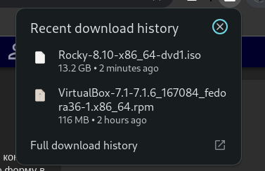
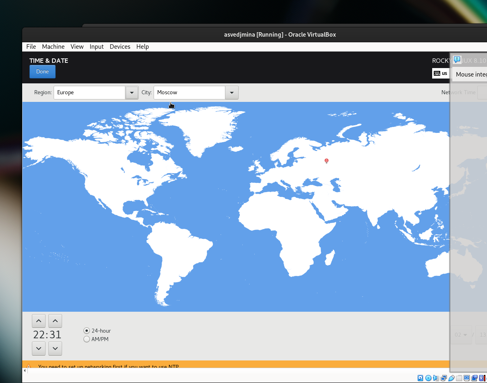

---
## Front matter
lang: ru-RU
title: Лабораторная работа 1
subtitle: Установка и конфигурация операционной системы на виртуальную машину
author:
  - Ведьмина Александра Сергеевна
institute:
  - Российский университет дружбы народов, Москва, Россия

## i18n babel
babel-lang: russian
babel-otherlangs: english

## Formatting pdf
toc: false
toc-title: Содержание
slide_level: 2
aspectratio: 169
section-titles: true
theme: metropolis
header-includes:
 - \metroset{progressbar=frametitle,sectionpage=progressbar,numbering=fraction}
 - '\makeatletter'
 - '\beamer@ignorenonframefalse'
 - '\makeatother'
---

# Информация

## Докладчик

:::::::::::::: {.columns align=center}
::: {.column width="70%"}

  * Ведьмина Александра Сергеевна
  * студентка
  * Российский университет дружбы народов
  * [1132236003@rudn.ru](mailto:1132236003@rudn.ru)
  * <https://asvedjmina.github.io/ru/>

:::
::: {.column width="30%"}

:::
::::::::::::::

# Вводная часть

## Цели и задачи

Целью данной работы является приобретение практических навыков
установки операционной системы на виртуальную машину, настройки минимально необходимых для дальнейшей работы сервисов.

# Ход работы

## Выполнение лабораторной работы

Скачиваю Virtual Box и rocky.

{#fig:001 width=100%}

## Выполнение лабораторной работы

Запускаю Virtual Box.

{#fig:002 width=100%}

## Выполнение лабораторной работы

Создаю новую вм. Запускаю роки.

{#fig:003 width=100%}

## Выполнение лабораторной работы

Затем загружаю rocky, произвожу необходимую настройку.

{#fig:004 width=100%}

## Выполнение заданий

{#fig:005 width=100%}

## Выполнение заданий

{#fig:006 width=100%}

## Выполнение заданий

{#fig:007 width=100%}

# Результаты

В ходе лабораторной работы получилось успешно установить виртуальную машину с rocky linux.
