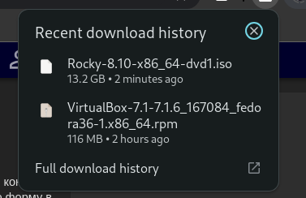
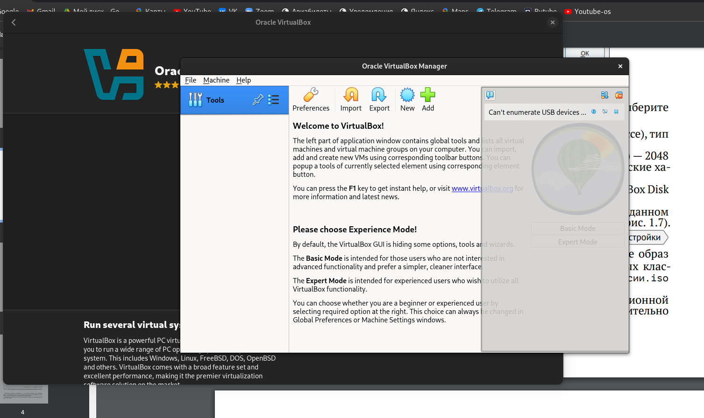
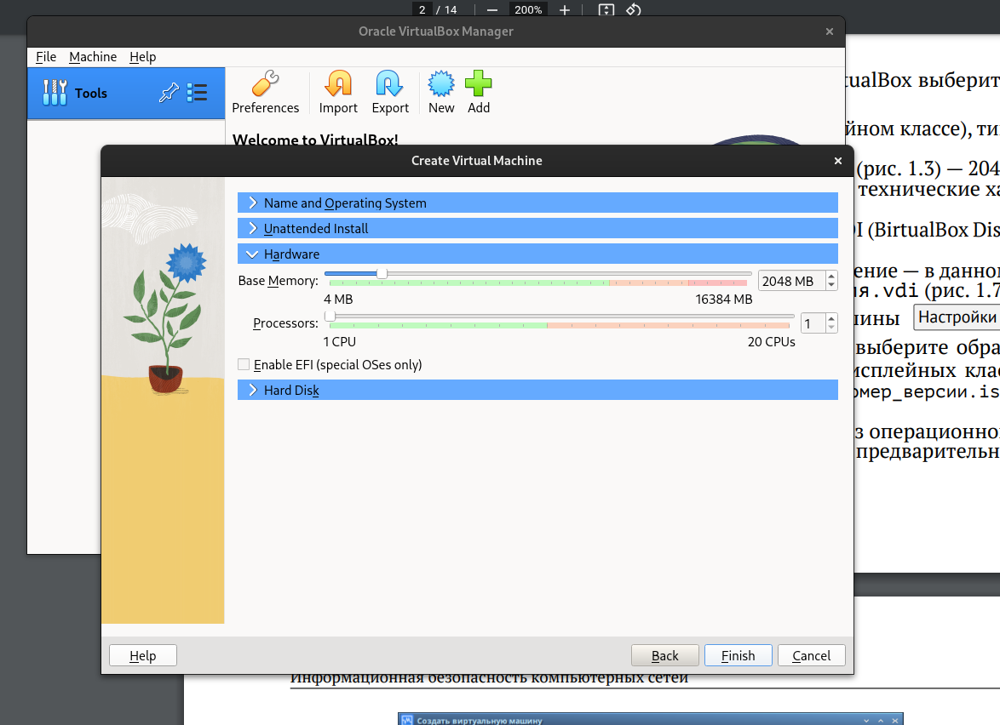
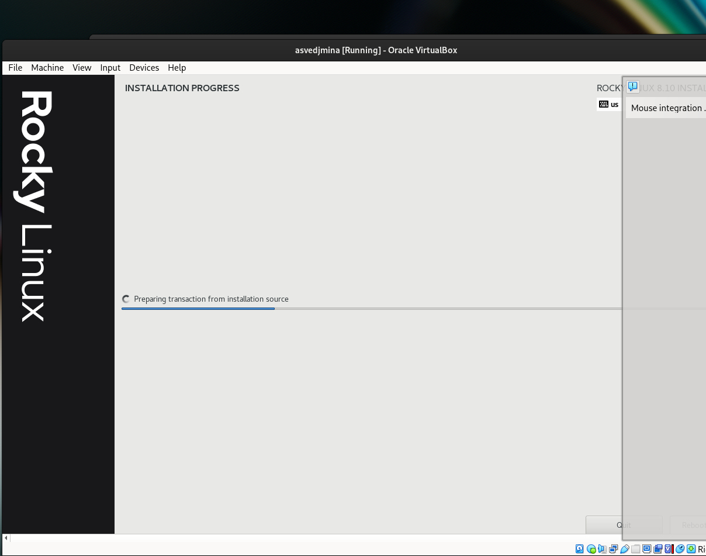
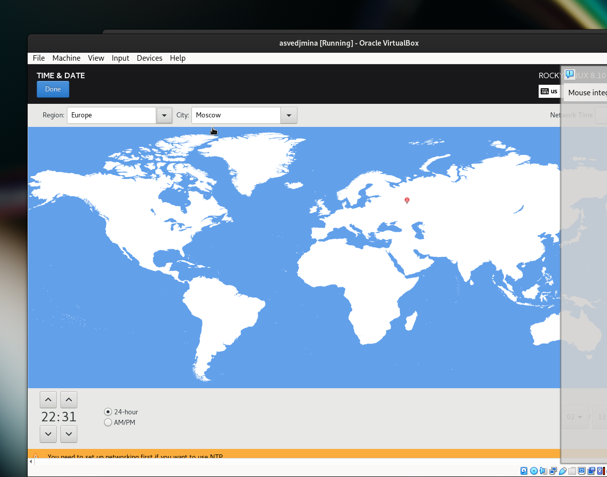
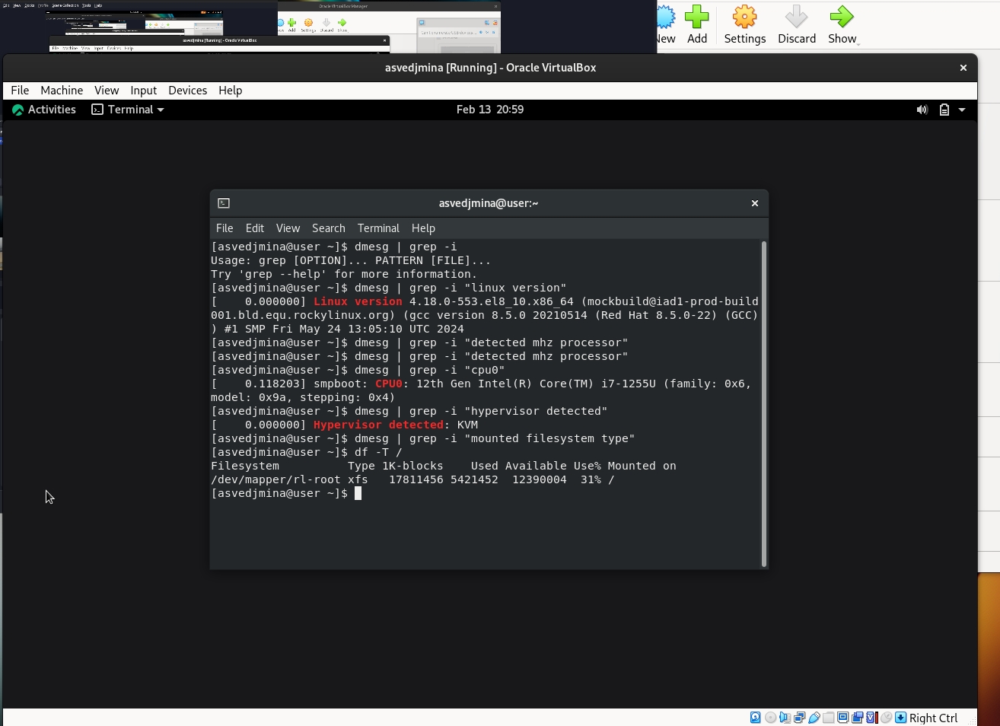

---
## Front matter
title: "Лабораторная работа"
subtitle: "Установка и конфигурация
операционной системы на виртуальную машину"
author: "Ведьмина Александра Сергеевна"

## Generic otions
lang: ru-RU
toc-title: "Содержание"

## Bibliography
bibliography: bib/cite.bib
csl: pandoc/csl/gost-r-7-0-5-2008-numeric.csl

## Pdf output format
toc: true # Table of contents
toc-depth: 2
lof: true # List of figures
lot: true # List of tables
fontsize: 12pt
linestretch: 1.5
papersize: a4
documentclass: scrreprt
## I18n polyglossia
polyglossia-lang:
  name: russian
  options:
	- spelling=modern
	- babelshorthands=true
polyglossia-otherlangs:
  name: english
## I18n babel
babel-lang: russian
babel-otherlangs: english
## Fonts
mainfont: PT Serif
romanfont: PT Serif
sansfont: PT Sans
monofont: PT Mono
mainfontoptions: Ligatures=TeX
romanfontoptions: Ligatures=TeX
sansfontoptions: Ligatures=TeX,Scale=MatchLowercase
monofontoptions: Scale=MatchLowercase,Scale=0.9
## Biblatex
biblatex: true
biblio-style: "gost-numeric"
biblatexoptions:
  - parentracker=true
  - backend=biber
  - hyperref=auto
  - language=auto
  - autolang=other*
  - citestyle=gost-numeric
## Pandoc-crossref LaTeX customization
figureTitle: "Рис."
tableTitle: "Таблица"
listingTitle: "Листинг"
lofTitle: "Список иллюстраций"
lotTitle: "Список таблиц"
lolTitle: "Листинги"
## Misc options
indent: true
header-includes:
  - \usepackage{indentfirst}
  - \usepackage{float} # keep figures where there are in the text
  - \floatplacement{figure}{H} # keep figures where there are in the text
---

# Цель работы

Целью данной работы является приобретение практических навыков
установки операционной системы на виртуальную машину, настройки минимально необходимых для дальнейшей работы сервисов.

# Задание

Установить виртуальную машину и rocky linux.

# Теоретическое введение

Виртуальные машины используются для разработки в безопасной среде. Можно организовать безопасную рабочую среду, где можно тестировать любой код, не переживая, что он как-то навредит основной системе или к нему кто-то получит доступ извне. 
А также эмуляции среды: можно настроить виртуальную систему под определённые параметры, чтобы проверить работу созданной программы в этих условиях. Например, сделать «слабую» виртуальную машину, чтобы посмотреть, как новая игра будет работать на маломощных компьютерах.

# Выполнение лабораторной работы

Скачиваю Virtual Box и rocky.

{#fig:001 width=100%}

Запускаю Virtual Box.

{#fig:002 width=100%}

Создаю новую вм. Запускаю роки.

{#fig:003 width=100%}

Загружаю роки.

{#fig:004 width=100%}

Настраиваю систему.

{#fig:005 width=100%}

Всё получилось! Теперь делаю задания:

1. Версия ядра Linux (Linux version).
2. Частота процессора (Detected Mhz processor).
3. Модель процессора (CPU0).
4. Объем доступной оперативной памяти (Memory available).
5. Тип обнаруженного гипервизора (Hypervisor detected).
6. Тип файловой системы корневого раздела.

{#fig:006 width=100%}

{#fig:007 width=100%}

{#fig:008 width=100%}

# Контрольные вопросы

1. Какую информацию содержит учётная запись пользователя?

Логин, имя, фамилия, адрес почты, возможно время входа/выхода.

2. Укажите команды терминала и приведите примеры:

– для получения справки по команде;
man <имя_команды>

– для перемещения по файловой системе;
cd <путь_к_каталогу>

– для просмотра содержимого каталога;
ls

– для определения объёма каталога;
du -sh <путь_к_каталогу>

– для создания / удаления каталогов / файлов;
mkdir, rm, rmdir

– для задания определённых прав на файл / каталог;
chmod

– для просмотра истории команд.
history

3. Что такое файловая система? Приведите примеры с краткой характеристикой.

Это способ организации и хранения данных на носителе информации. Например, ext4: файловая система в Linux, поддерживает большие объёмы данных и имеет высокую производительность; NTFS - основная файловая система для Windows. Windows использует её при форматировании жёсткого диска.

4. Как посмотреть, какие файловые системы подмонтированы в ОС?

df -h

5. Как удалить зависший процесс?

kill

# Выводы

В ходе лабораторной работы я успешно установила необходимые программы.

