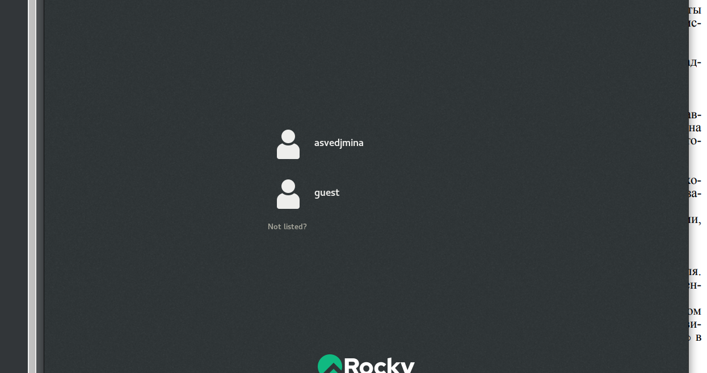
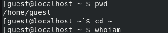
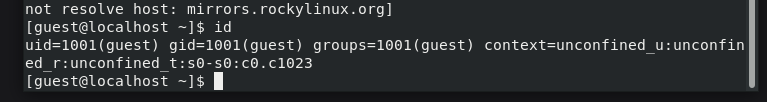
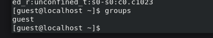
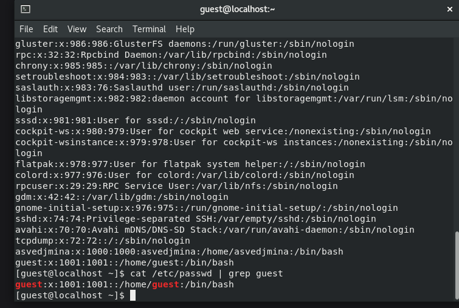
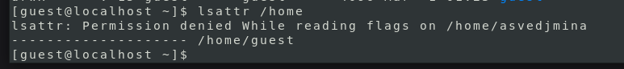
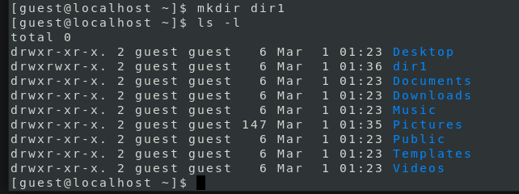
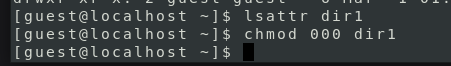

---
## Front matter
lang: ru-RU
title: Лабораторная работа 2
subtitle: "Дискреционное
разграничение прав в Linux. Основные
атрибуты"
author:
  - Ведьмина Александра Сергеевна
institute:
  - Российский университет дружбы народов, Москва, Россия

## i18n babel
babel-lang: russian
babel-otherlangs: english

## Formatting pdf
toc: false
toc-title: Содержание
slide_level: 2
aspectratio: 169
section-titles: true
theme: metropolis
header-includes:
 - \metroset{progressbar=frametitle,sectionpage=progressbar,numbering=fraction}
 - '\makeatletter'
 - '\beamer@ignorenonframefalse'
 - '\makeatother'
---

# Информация

## Докладчик

:::::::::::::: {.columns align=center}
::: {.column width="70%"}

  * Ведьмина Александра Сергеевна
  * студентка
  * Российский университет дружбы народов
  * [1132236003@rudn.ru](mailto:1132236003@rudn.ru)
  * <https://asvedjmina.github.io/ru/>

:::
::: {.column width="30%"}

:::
::::::::::::::

# Вводная часть

## Цели и задачи

Получение практических навыков работы в консоли с атрибутами файлов, закрепление теоретических основ дискреционного разграничения доступа в современных системах с открытым кодом на базе ОС Linux1.

# Выполнение лабораторной работы

Создаю нового пользователя guest командами useradd guest, ставлю пароль, вхожу в систему как guest

{#fig:001 width=100%}

## Выполнение лабораторной работы

Определяю директорию, в которой нахожусь. Она домашняя.

{#fig:002 width=100%}

## Выполнение лабораторной работы

Смотрю id.

{#fig:003 width=100%}

## Выполнение лабораторной работы

Смотрю groups. Информацию об имени пользователя совпадает с данными,
выводимыми в приглашении командной строки.

{#fig:004 width=100%}

## Выполнение лабораторной работы

Смотрю файл /etc/passwd командой cat /etc/passwd. Нахожу в нём свою учётную запись.

{#fig:005 width=100%}

## Выполнение лабораторной работы

Вывожу список директорий с их правами.

{#fig:006 width=100%}

## Выполнение лабораторной работы

Не могу посмотреть расширенные атрибуты lsattr /home.

{#fig:007 width=100%}

## Выполнение лабораторной работы

Создаю директорию dir1 и смотрю права доступа.

{#fig:008 width=100%}

## Выполнение лабораторной работы

Снимаю их все.

{#fig:009 width=100%}

## Выполнение лабораторной работы

Создаю в директории dir1 файл file1 командой echo "test" > /home/guest/dir1/file1, но получаю ошибку.

{#fig:010 width=100%}

# Выводы

Получила навыки работы в консоли с атрибутами файлов.
