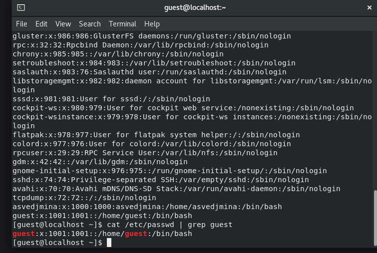

---
## Front matter
title: "Лабораторная работа 2"
subtitle: "Дискреционное
разграничение прав в Linux. Основные
атрибуты"
author: "Ведьмина Александра Сергеевна"

## Generic otions
lang: ru-RU
toc-title: "Содержание"

## Bibliography
bibliography: bib/cite.bib
csl: pandoc/csl/gost-r-7-0-5-2008-numeric.csl

## Pdf output format
toc: true # Table of contents
toc-depth: 2
lof: true # List of figures
lot: true # List of tables
fontsize: 12pt
linestretch: 1.5
papersize: a4
documentclass: scrreprt
## I18n polyglossia
polyglossia-lang:
  name: russian
  options:
	- spelling=modern
	- babelshorthands=true
polyglossia-otherlangs:
  name: english
## I18n babel
babel-lang: russian
babel-otherlangs: english
## Fonts
mainfont: PT Serif
romanfont: PT Serif
sansfont: PT Sans
monofont: PT Mono
mainfontoptions: Ligatures=TeX
romanfontoptions: Ligatures=TeX
sansfontoptions: Ligatures=TeX,Scale=MatchLowercase
monofontoptions: Scale=MatchLowercase,Scale=0.9
## Biblatex
biblatex: true
biblio-style: "gost-numeric"
biblatexoptions:
  - parentracker=true
  - backend=biber
  - hyperref=auto
  - language=auto
  - autolang=other*
  - citestyle=gost-numeric
## Pandoc-crossref LaTeX customization
figureTitle: "Рис."
tableTitle: "Таблица"
listingTitle: "Листинг"
lofTitle: "Список иллюстраций"
lotTitle: "Список таблиц"
lolTitle: "Листинги"
## Misc options
indent: true
header-includes:
  - \usepackage{indentfirst}
  - \usepackage{float} # keep figures where there are in the text
  - \floatplacement{figure}{H} # keep figures where there are in the text
---

# Цель работы

Получение практических навыков работы в консоли с атрибутами файлов, закрепление теоретических основ дискреционного разграничения доступа в современных системах с открытым кодом на базе ОС Linux1

# Выполнение лабораторной работы

Создаю нового пользователя guest командами useradd guest, ставлю пароль, вхожу в систему как guest

{#fig:001 width=100%}

Определяю директорию, в которой нахожусь. Она домашняя.

{#fig:002 width=100%}

Смотрю id.

{#fig:003 width=100%}

Смотрю groups. Информацию об имени пользователя совпадает с данными,
выводимыми в приглашении командной строки.

{#fig:004 width=100%}

Смотрю файл /etc/passwd командой cat /etc/passwd. Нахожу в нём свою учётную запись.

{#fig:005 width=100%}

Вывожу список директорий с их правами.

{#fig:006 width=100%}

Не могу посмотреть расширенные атрибуты lsattr /home.

{#fig:007 width=100%}

Создаю директорию dir1 и смотрю права доступа.

{#fig:008 width=100%}

Снимаю их все.

{#fig:009 width=100%}

Создаю в директории dir1 файл file1 командой echo "test" > /home/guest/dir1/file1, но получаю ошибку.

{#fig:010 width=100%}

Делаю таблицу с «Установленными правами и разрешёнными действиями»:

| | | | | |
|-|-|-|-|-|
|Операция| |Минимальные  права на  директорию| |Минимальные  права на файл|
|Создание файла| |d(300)| |-|
|Удаление файла| |d(300)| |-|
|Чтение файла| |d(100)| |(400)|
|Запись в файл| |d(100)| |(200)|
|Переименование файла| |d(300)| |(000)|
|Создание поддиректории| |d(300)| |-|
|Удаление поддиректории| |d(300)| |-|

# Выводы

Получила навыки работы в консоли с атрибутами файлов.

