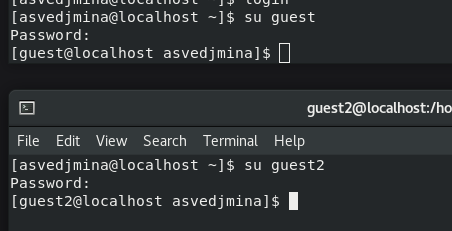
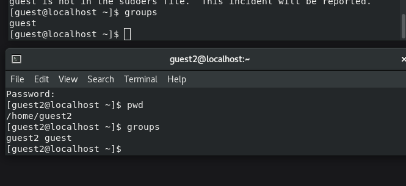
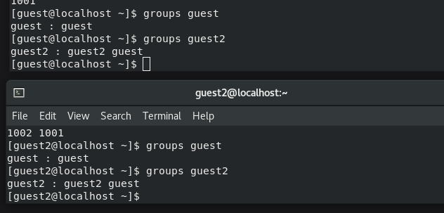
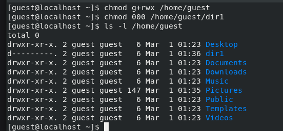

---
## Front matter
title: "Лабораторная работа 6" 
subtitle: "Мандатное разграничение прав в Linux"
author: "Ведьмина Александра Сергеевна"

## Generic otions
lang: ru-RU
toc-title: "Содержание"

## Bibliography
bibliography: bib/cite.bib
csl: pandoc/csl/gost-r-7-0-5-2008-numeric.csl

## Pdf output format
toc: true # Table of contents
toc-depth: 2
lof: true # List of figures
lot: true # List of tables
fontsize: 12pt
linestretch: 1.5
papersize: a4
documentclass: scrreprt
## I18n polyglossia
polyglossia-lang:
  name: russian
  options:
	- spelling=modern
	- babelshorthands=true
polyglossia-otherlangs:
  name: english
## I18n babel
babel-lang: russian
babel-otherlangs: english
## Fonts
mainfont: PT Serif
romanfont: PT Serif
sansfont: PT Sans
monofont: PT Mono
mainfontoptions: Ligatures=TeX
romanfontoptions: Ligatures=TeX
sansfontoptions: Ligatures=TeX,Scale=MatchLowercase
monofontoptions: Scale=MatchLowercase,Scale=0.9
## Biblatex
biblatex: true
biblio-style: "gost-numeric"
biblatexoptions:
  - parentracker=true
  - backend=biber
  - hyperref=auto
  - language=auto
  - autolang=other*
  - citestyle=gost-numeric
## Pandoc-crossref LaTeX customization
figureTitle: "Рис."
tableTitle: "Таблица"
listingTitle: "Листинг"
lofTitle: "Список иллюстраций"
lotTitle: "Список таблиц"
lolTitle: "Листинги"
## Misc options
indent: true
header-includes:
  - \usepackage{indentfirst}
  - \usepackage{float} # keep figures where there are in the text
  - \floatplacement{figure}{H} # keep figures where there are in the text
---

# Цель работы

Развить навыки администрирования ОС Linux. Получить первое практическое знакомство с технологией SELinux1.
Проверить работу SELinx на практике совместно с веб-сервером
Apache.

# Задание

Выполнить задания из файла в туисе.

# Выполнение лабораторной работы

Вхожу в систему с полученными учётными данными и убедитесь, что
SELinux работает в режиме enforcing политики targeted с помощью команд getenforce и sestatus.

{#fig:002 width=100%}

Вхожу в пользователей с разных консолей.

{#fig:003 width=100%}

Смотрю директории с помощью pwd.

{#fig:004 width=100%}

Уточните имя вашего пользователя, его группу, кто входит в неё и к каким группам принадлежит он сам. Определите командами groups guest и groups guest2, в какие группы входят пользователи guest и guest2. Сравните вывод команды groups с выводом команд id -Gn и id -G.

{#fig:005 width=100%}

{#fig:006 width=100%}

От имени пользователя guest2 выполняю регистрацию пользователя guest2 в группе guest.

{#fig:007 width=100%}

От имени пользователя guest изменяю права директории /home/guest, разрешив все действия для пользователей группы.

{#fig:008 width=100%}

Снимаю с директории /home/guest/dir1 все атрибуты командой.

{#fig:009 width=100%}

{#fig:010 width=100%}

# Выводы

В ходе лабораторной работы я получила практические навыки работы в консоли с атрибутами файлов для групп пользователей.

