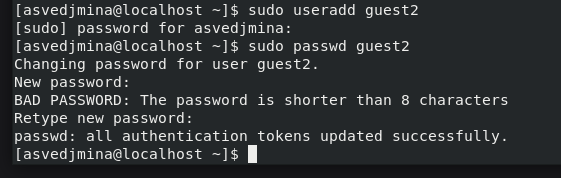
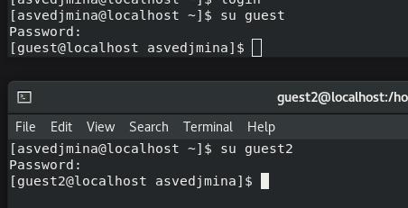
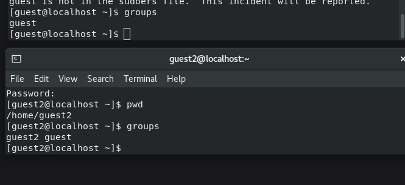
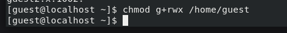
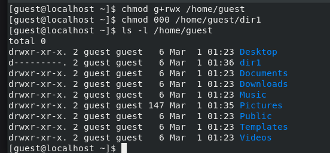
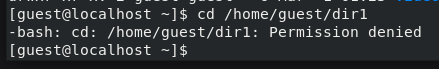

---
## Front matter
lang: ru-RU
title: Лабораторная работа 8
subtitle: Элементы криптографии. Шифрование (кодирование) различных исходных текстов одним ключом
author:
  - Ведьмина Александра Сергеевна
institute:
  - Российский университет дружбы народов, Москва, Россия

## i18n babel
babel-lang: russian
babel-otherlangs: english

## Formatting pdf
toc: false
toc-title: Содержание
slide_level: 2
aspectratio: 169
section-titles: true
theme: metropolis
header-includes:
 - \metroset{progressbar=frametitle,sectionpage=progressbar,numbering=fraction}
 - '\makeatletter'
 - '\beamer@ignorenonframefalse'
 - '\makeatother'
---

# Информация

## Докладчик

:::::::::::::: {.columns align=center}
::: {.column width="70%"}

  * Ведьмина Александра Сергеевна
  * студентка
  * Российский университет дружбы народов
  * [1132236003@rudn.ru](mailto:1132236003@rudn.ru)
  * <https://asvedjmina.github.io/ru/>

:::
::: {.column width="30%"}

:::
::::::::::::::

# Цель работы

Освоить на практике применение режима однократного гаммирования на примере кодирования различных исходных текстов одним ключом.

# Задание

Выполнить задания из файла в туисе.

# Указания к работе

Две телеграммы Центра:

1) P1 = НаВашисходящийот1204
2) P2 = ВСеверныйфилиалБанка

Ключ Центра длиной 20 байт:

K = 05 0C 17 7F 0E 4E 37 D2 94 10 09 2E 22 57 FF C8 OB B2 70 54

Режим шифрования однократного гаммирования одним ключом двух видов открытого текста реализуется в соответствии со схемой.
Шифротексты обеих телеграмм можно получить по формулам режима однократного гаммирования.

# Выполнение лабораторной работы

## Выполнение лабораторной работы

Создаю пользователей guest и guest2.

{#fig:001 width=100%}

## Выполнение лабораторной работы

Добавляю пользователя guest2 в группу guest.

{#fig:002 width=100%}

## Выполнение лабораторной работы

Вхожу в пользователей с разных консолей.

{#fig:003 width=100%}

## Выполнение лабораторной работы

Смотрю директории с помощью pwd.

{#fig:004 width=100%}

## Выполнение лабораторной работы

Уточните имя вашего пользователя, его группу, кто входит в неё и к каким группам принадлежит он сам. Определите командами groups guest и groups guest2, в какие группы входят пользователи guest и guest2. Сравните вывод команды groups с выводом команд id -Gn и id -G.

{#fig:005 width=100%}

## Выполнение лабораторной работы

{#fig:006 width=100%}

## Выполнение лабораторной работы

От имени пользователя guest2 выполняю регистрацию пользователя guest2 в группе guest.

{#fig:007 width=100%}

## Выполнение лабораторной работы

От имени пользователя guest изменяю права директории /home/guest, разрешив все действия для пользователей группы.

{#fig:008 width=100%}

## Выполнение лабораторной работы

Снимаю с директории /home/guest/dir1 все атрибуты командой.

{#fig:009 width=100%}

## Выполнение лабораторной работы

{#fig:010 width=100%}

# Выводы

В ходе лабораторной работы я получила практические навыки работы в консоли с атрибутами файлов для групп пользователей.

