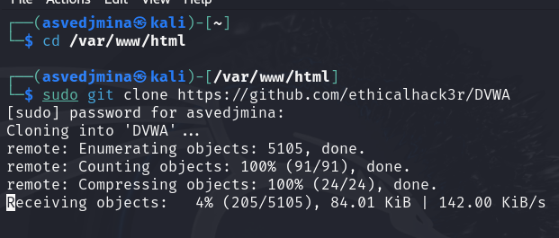
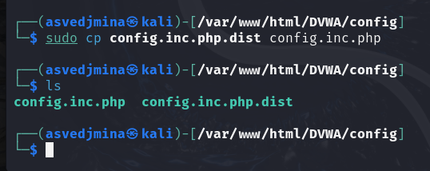
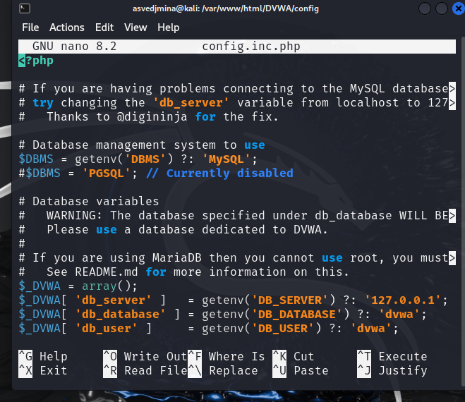
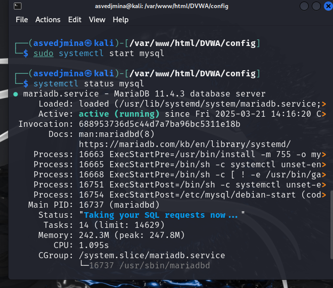
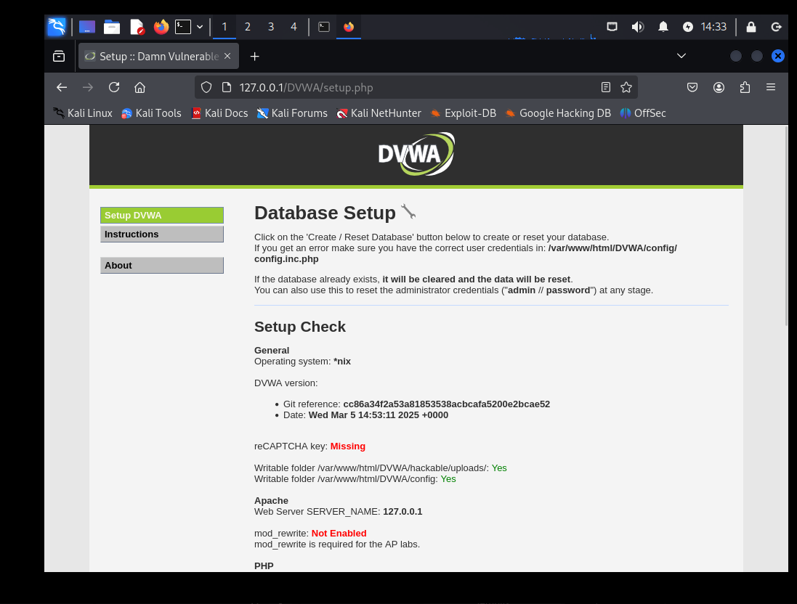

---
## Front matter
lang: ru-RU
title: Индивидуальный проект
subtitle: Этап 2
author:
  - Ведьмина Александра Сергеевна
institute:
  - Российский университет дружбы народов, Москва, Россия

## i18n babel
babel-lang: russian
babel-otherlangs: english

## Formatting pdf
toc: false
toc-title: Содержание
slide_level: 2
aspectratio: 169
section-titles: true
theme: metropolis
header-includes:
 - \metroset{progressbar=frametitle,sectionpage=progressbar,numbering=fraction}
 - '\makeatletter'
 - '\beamer@ignorenonframefalse'
 - '\makeatother'
---

# Информация

## Докладчик

:::::::::::::: {.columns align=center}
::: {.column width="70%"}

  * Ведьмина Александра Сергеевна
  * студентка
  * Российский университет дружбы народов
  * [1132236003@rudn.ru](mailto:1132236003@rudn.ru)
  * <https://asvedjmina.github.io/ru/>

:::
::: {.column width="30%"}

:::
::::::::::::::

# Вводная часть

## Цели и задачи

Приобретение практических навыков по установке DVWA.

# Выполнение лабораторной работы

## Выполнение лабораторной работы

Перехожу в директорию `/var/www/html`. Клонирую нужный репозиторий.

{#fig:001 width=100%}

## Выполнение лабораторной работы

Повышаю права доступа к этой папке до 777.

{#fig:002 width=100%}

## Выполнение лабораторной работы

Создаем копию файла, используемого для настройки DVWA `config.inc.php.dist` с именем `config.inc.php`. Делаю копию.

{#fig:003 width=100%}

## Выполнение лабораторной работы

Далее открываю файл в текстовом редакторе.

{#fig:004 width=100%}

## Выполнение лабораторной работы

Проверяю запуск mysql.

{#fig:005 width=100%}

## Выполнение лабораторной работы

Авторизируюсь в базе данных от имени пользователя root. Появляется командная строка с приглашением "MariaDB", далее создаем в ней нового пользователя, используя учетные данные из файла config.inc.php. Затем предаставляем привилегии для работы с этой базой данных.

## Выполнение лабораторной работы

Настраиваю apache2.

{#fig:006 width=100%}

## Выполнение лабораторной работы

Мы настроили DVWA, Apache и базу данных, поэтому открываем браузер и запускаем веб-приложение, введя 127.0.0/DVWA. Нажимаю на кнопку `create\reset database`.

{#fig:007 width=100%}

# Выводы

В ходе выполнения лабораторной работы я приобрела практические навыки по установке уязвимого веб-приложения DVWA.

