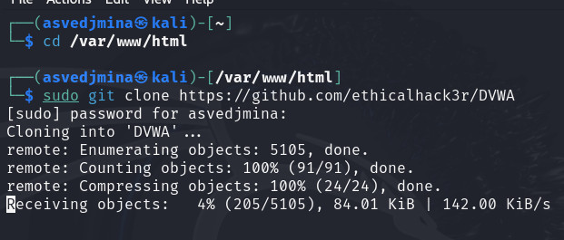
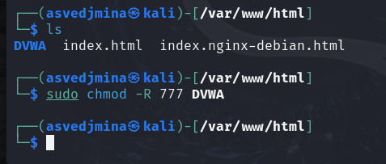
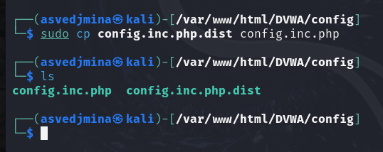
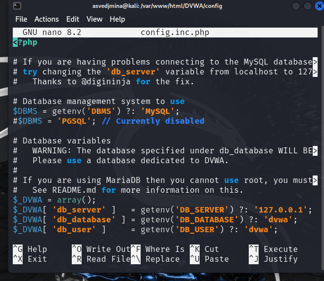
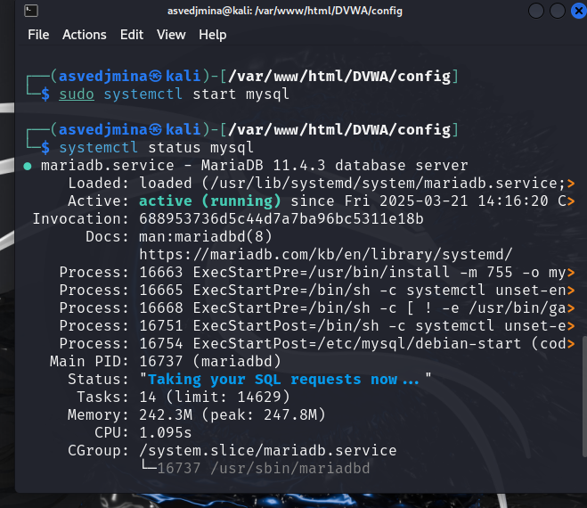
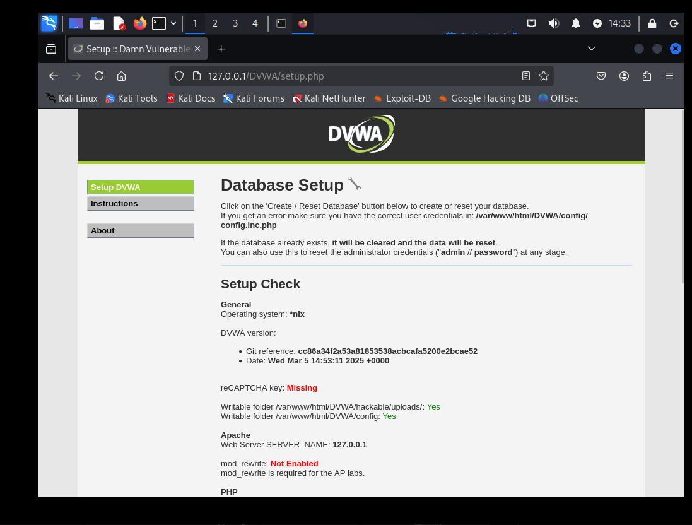

---
## Front matter
title: "Индивидуальный проект"
subtitle: "Этап 5"
author: "Ведьмина Александра Сергеевна"

## Generic otions
lang: ru-RU
toc-title: "Содержание"

## Bibliography
bibliography: bib/cite.bib
csl: pandoc/csl/gost-r-7-0-5-2008-numeric.csl

## Pdf output format
toc: true # Table of contents
toc-depth: 2
lof: true # List of figures
lot: true # List of tables
fontsize: 12pt
linestretch: 1.5
papersize: a4
documentclass: scrreprt
## I18n polyglossia
polyglossia-lang:
  name: russian
  options:
	- spelling=modern
	- babelshorthands=true
polyglossia-otherlangs:
  name: english
## I18n babel
babel-lang: russian
babel-otherlangs: english
## Fonts
mainfont: PT Serif
romanfont: PT Serif
sansfont: PT Sans
monofont: PT Mono
mainfontoptions: Ligatures=TeX
romanfontoptions: Ligatures=TeX
sansfontoptions: Ligatures=TeX,Scale=MatchLowercase
monofontoptions: Scale=MatchLowercase,Scale=0.9
## Biblatex
biblatex: true
biblio-style: "gost-numeric"
biblatexoptions:
  - parentracker=true
  - backend=biber
  - hyperref=auto
  - language=auto
  - autolang=other*
  - citestyle=gost-numeric
## Pandoc-crossref LaTeX customization
figureTitle: "Рис."
tableTitle: "Таблица"
listingTitle: "Листинг"
lofTitle: "Список иллюстраций"
lotTitle: "Список таблиц"
lolTitle: "Листинги"
## Misc options
indent: true
header-includes:
  - \usepackage{indentfirst}
  - \usepackage{float} # keep figures where there are in the text
  - \floatplacement{figure}{H} # keep figures where there are in the text
---

# Цель работы

Научиться использовать Burp Suite.

# Задание

Установить BUrp Suite на дистрибутив Kali Linux.

# Выполнение лабораторной работы

Перехожу в директорию `/var/www/html`. Клонирую нужный репозиторий.

{#fig:001 width=100%}

Повышаю права доступа к этой папке до 777.

{#fig:002 width=100%}

Создаем копию файла, используемого для настройки DVWA `config.inc.php.dist` с именем `config.inc.php`. Делаю копию.

{#fig:003 width=100%}

Далее открываю файл в текстовом редакторе.

{#fig:004 width=100%}

Проверяю запуск mysql.

{#fig:005 width=100%}

Авторизируюсь в базе данных от имени пользователя root. Появляется командная строка с приглашением "MariaDB", далее создаем в ней нового пользователя, используя учетные данные из файла config.inc.php. Затем предаставляем привилегии для работы с этой базой данных.

Настраиваю apache2.

![Настройка apache2](image/Screenshot from 2025-03-21 22-26-30.png{#fig:006 width=100%}

Мы настроили DVWA, Apache и базу данных, поэтому открываем браузер и запускаем веб-приложение, введя 127.0.0/DVWA. Нажимаю на кнопку `create\reset database`.

{#fig:007 width=100%}

# Выводы

В ходе выполнения лабораторной работы я приобрела практические навыки по установке уязвимого веб-приложения DVWA.

